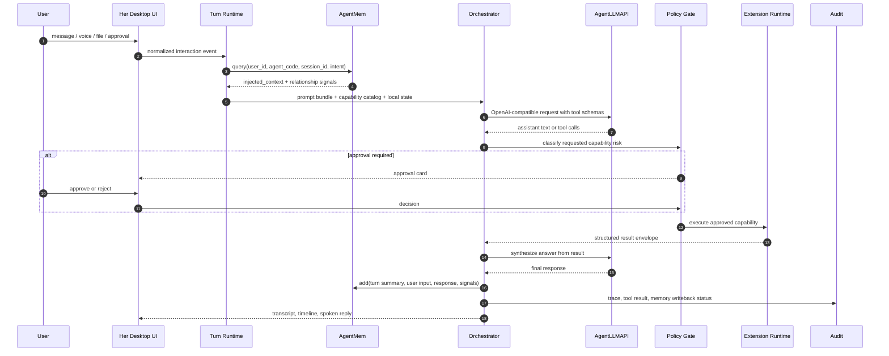

# Her Desktop Architecture Map

目标：Her Desktop 是 Mac 原生的 AI 数字合伙人。它不是 AgentLLMAPI 或 AgentMem 的薄壳客户端，而是负责体验、上下文、工具编排、权限、审计和本机工作区的主产品；AgentLLMAPI 提供模型基础设施，AgentMem 提供长期记忆与关系建模，插件平台提供可扩展工作能力。

## System Architecture

```mermaid
flowchart TB
    User["User<br/>text / voice / files / approvals"]

    subgraph MacApp["Her Desktop - Mac Native App"]
        UI["SwiftUI Experience Layer<br/>conversation / sidebar / inspector / Her-style ambient UI"]
        Inbox["Interaction Surfaces<br/>composer / voice / attachments / local inbox bridge"]
        EventBus["Interaction Event Bus<br/>normalize text, voice, file, inbox events"]
        Turn["Turn Runtime<br/>task state / cancellation / timeline / resume"]
        Context["Context Composer<br/>SOUL + INFINITI + session + active work + memory"]
        Orchestrator["Agent Orchestrator<br/>bounded tool loop / synthesis / follow-up"]
        Policy["Policy and Approval Gate<br/>risk class / human approval / secret boundary"]
        Audit["Audit and Observability<br/>tool traces / memory status / service health"]
        Workspace[("Local Workspace<br/>.her/session<br/>.her/attachments<br/>.her/plugins<br/>.her/inbox<br/>audit logs")]
    end

    subgraph LLM["AgentLLMAPI - Model Infrastructure"]
        LLMGateway["OpenAI-compatible Gateway<br/>chat / responses / images / video / embeddings"]
        AgentRouter["Agent Router and Smart Mode<br/>model aliases / expert routing / trust + price"]
        Reliability["Reliability Layer<br/>fallback / circuit breaker / probes"]
        Usage["Tenant, ACL, Usage and Billing<br/>keys / quotas / cost records"]
    end

    subgraph Mem["AgentMem - Memory as a Service"]
        MemQuery["Pre-turn Query<br/>facts / preferences / relationship / intent"]
        MemAdd["Post-turn Add<br/>fire-and-forget writeback"]
        Extract["Async Memory Pipeline<br/>fact extraction / conflict resolution / consolidation"]
        Dream["Dream and Reflection Engine<br/>long-term consolidation / proactive insights"]
        MemStore[("Memory Stores<br/>facts / graph / sliding window / affection")]
    end

    subgraph Ext["Extension Platform"]
        Composer["Vibe Plugin Composer<br/>natural-language capability creation"]
        Review["Plugin Review<br/>manifest / permissions / install approval"]
        Registry["Plugin Registry<br/>bundled + user .her/plugins"]
        Catalog["Tool Catalog<br/>function schemas exposed to model"]
        Executor["Capability Executor<br/>adapter isolation / structured result"]
        Skill["Skill Adapter<br/>SKILL.md workflows"]
        WebService["WebService Adapter<br/>declared HTTP APIs"]
        MCP["MCP Adapter<br/>local JSON-RPC bridge<br/>tools/call + toolName"]
        MCPDiscovery["MCP Discovery<br/>tools/list"]
        Command["Command Adapter<br/>fixed executable and args"]
        Native["Native Adapter<br/>macOS notifications / files / speech"]
    end

    subgraph World["External Work World"]
        MacOS["macOS Apps<br/>Files / Calendar / Mail / Shortcuts"]
        Dev["Developer Tools<br/>Codex / git / terminal / IDE"]
        SaaS["SaaS and Web APIs<br/>search / docs / business systems"]
        Social["External Inboxes<br/>Oyii / WeChat / Discord / browser"]
        Devices["Devices<br/>phone / tablet / wearables"]
    end

    subgraph Infiniti["Infiniti Agent Assets"]
        Soul["SOUL.md / INFINITI.md<br/>personality and operating principles"]
        Skills["Existing Skills<br/>portable workflows"]
        LiveLessons["LiveUI and Voice Lessons<br/>avatar / ASR / TTS / realtime patterns"]
    end

    User --> UI
    User --> Inbox
    Social --> Inbox
    Inbox --> EventBus
    UI --> EventBus
    EventBus --> Turn
    Turn --> Workspace
    Workspace --> Context
    Soul --> Context
    Skills --> Registry
    LiveLessons --> UI

    Turn --> MemQuery
    MemQuery --> MemStore
    MemStore --> Context
    Context --> Orchestrator

    Orchestrator --> LLMGateway
    LLMGateway --> AgentRouter
    AgentRouter --> Reliability
    Reliability --> LLMGateway
    LLMGateway --> Usage
    LLMGateway --> Orchestrator

    Orchestrator --> Catalog
    Registry --> Catalog
    Catalog --> Policy
    Policy --> Executor
    Composer --> Review
    Review --> Registry
    Executor --> Skill
    Executor --> WebService
    Executor --> MCPDiscovery
    Executor --> MCP
    Executor --> Command
    Executor --> Native
    Skill --> Dev
    WebService --> SaaS
    MCPDiscovery --> MCP
    MCP --> MacOS
    Command --> Dev
    Native --> MacOS
    Native --> Devices
    Executor --> Orchestrator

    Orchestrator --> MemAdd
    MemAdd --> Extract
    Extract --> MemStore
    Extract -. async .-> Dream
    Dream --> MemStore

    Policy --> Audit
    Executor --> Audit
    LLMGateway --> Audit
    MemQuery --> Audit
    MemAdd --> Audit
    Audit --> UI
    Orchestrator --> UI

    classDef app fill:#fff7f0,stroke:#d46a55,color:#241210
    classDef llm fill:#eef6ff,stroke:#5d87b5,color:#10243d
    classDef mem fill:#f0fff4,stroke:#5b9c71,color:#102b1a
    classDef ext fill:#fff9dd,stroke:#b8962d,color:#2d2408
    classDef world fill:#f6f6f6,stroke:#888,color:#222
    classDef inf fill:#f7f1ff,stroke:#8d72b8,color:#241337

    class UI,Inbox,EventBus,Turn,Context,Orchestrator,Policy,Audit,Workspace app
    class LLMGateway,AgentRouter,Reliability,Usage llm
    class MemQuery,MemAdd,Extract,Dream,MemStore mem
    class Composer,Review,Registry,Catalog,Executor,Skill,WebService,MCP,Command,Native ext
    class MacOS,Dev,SaaS,Social,Devices world
    class Soul,Skills,LiveLessons inf
```

## Turn Data Flow

## Key Boundaries

- Her Desktop owns the product experience, local state, permissions, tool execution, and audit trail.
- AgentLLMAPI owns model routing, upstream reliability, endpoint compatibility, usage, quota, and cost records.
- AgentMem owns long-term memory, relationship state, emotional/intent signals, and async consolidation.
- Infiniti Agent assets are imported as prompt, workflow, LiveUI, and voice experience assets, not as the main runtime dependency.
- Plugins are not arbitrary model-side code execution. Every capability must pass through manifest, review, registry, tool schema, approval, executor, and audit.
- External platforms enter through a normalized interaction event layer first. Outbound replies require separate approved sender capabilities.
