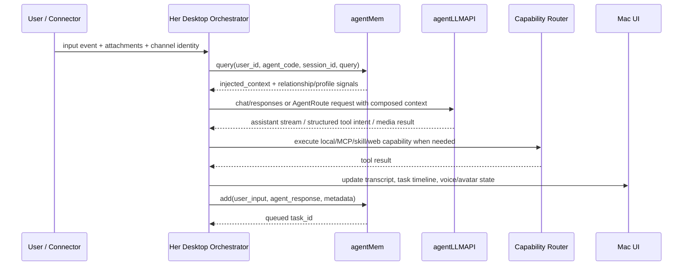
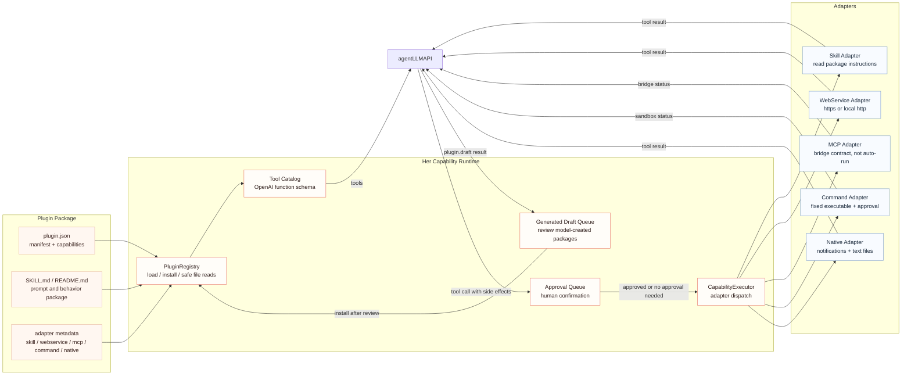
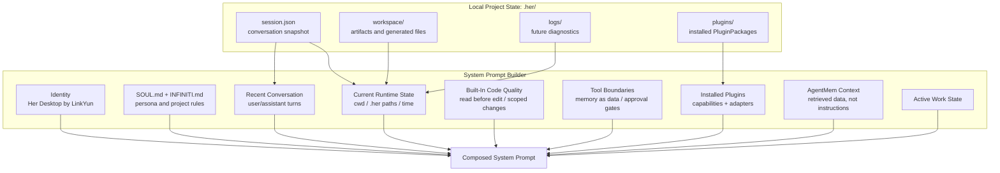

# Her Desktop Architecture V1

```mermaid
flowchart TB
    %% Surfaces
    subgraph S["Surfaces / Connectors"]
        Mac["Mac Native App\nSwiftUI / AppKit"]
        Oyii["Oyii"]
        Discord["Discord"]
        WeChat["WeChat"]
        Browser["Browser / Web Clip"]
        Mobile["Mobile / Tablet"]
    end

    %% Her desktop core
    subgraph H["Her Desktop Core"]
        Gateway["Connector Gateway\nidentity / channel / attachments"]
        Runtime["Interaction Runtime\nturn state / voice state / interruption / avatar state"]
        Orchestrator["Agent Orchestrator\ncontext composer / policy / task lifecycle"]
        CapRouter["Capability Router\nlocal cmd / MCP / skills / web services"]
        UIState["UI State Store\nconversation / timeline / panels"]
        NativeCaps["Native macOS Capabilities\nfiles / calendar / notifications / shortcuts"]
    end

    %% Platform services
    subgraph M["agentMem"]
        MemQuery["/v1/memory/query\ninjected_context"]
        MemAdd["/v1/memory/add\nfire-and-forget"]
        Profile["profile / relationship / affection"]
        Dream["dream / insight / consolidation"]
        MemStore["FactStore + Graph + SlidingWindow + AffectionStore"]
    end

    subgraph L["agentLLMAPI"]
        Chat["chat / responses"]
        AgentRoute["AgentRoute\nrouter -> candidates -> aggregation"]
        Media["image / video / audio / embeddings / rerank"]
        Realtime["realtime / ASR / TTS websocket bridges"]
        LLMRoute["route chain / smart mode / fallback / circuit breaker"]
        Billing["usage / credit / tenant ACL"]
    end

    subgraph I["Infiniti Agent / Tool Ecosystem"]
        Skills["Skills"]
        MCP["MCP Servers"]
        LiveUI["LiveUI / Avatar Renderers"]
        ProjectAgents["Project Agents\nsessions / sync / workspace"]
    end

    %% Surface ingress
    Mac --> Gateway
    Oyii --> Gateway
    Discord --> Gateway
    WeChat --> Gateway
    Browser --> Gateway
    Mobile --> Gateway

    %% Her core flow
    Gateway --> Runtime
    Runtime --> Orchestrator
    Orchestrator --> UIState
    UIState --> Mac
    Orchestrator --> CapRouter
    CapRouter --> NativeCaps
    CapRouter --> Skills
    CapRouter --> MCP
    CapRouter --> ProjectAgents
    Runtime --> LiveUI

    %% Memory flow
    Orchestrator -->|"before turn: retrieve context"| MemQuery
    Orchestrator -->|"after turn: persist turn"| MemAdd
    Orchestrator -->|"relationship UI / personalization"| Profile
    MemQuery --> MemStore
    MemAdd --> MemStore
    Profile --> MemStore
    Dream --> MemStore
    MemAdd -. "idle consolidation" .-> Dream

    %% LLM flow
    Orchestrator -->|"reasoning request"| Chat
    Orchestrator -->|"specialist routing"| AgentRoute
    Orchestrator -->|"multimodal request"| Media
    Runtime -->|"voice session"| Realtime
    Chat --> LLMRoute
    AgentRoute --> LLMRoute
    Media --> LLMRoute
    Realtime --> LLMRoute
    LLMRoute --> Billing

    %% Results back
    Chat --> Orchestrator
    AgentRoute --> Orchestrator
    Media --> Orchestrator
    Realtime --> Runtime

    %% Styling
    classDef surface fill:#fff7f1,stroke:#e8b7a2,color:#3b2420
    classDef her fill:#fffdf9,stroke:#e76f61,color:#2f1e1b
    classDef mem fill:#f7fff8,stroke:#78b98a,color:#183321
    classDef llm fill:#f8fbff,stroke:#7a9cc6,color:#172638
    classDef eco fill:#fffbea,stroke:#d6b55d,color:#332b12

    class Mac,Oyii,Discord,WeChat,Browser,Mobile surface
    class Gateway,Runtime,Orchestrator,CapRouter,UIState,NativeCaps her
    class MemQuery,MemAdd,Profile,Dream,MemStore mem
    class Chat,AgentRoute,Media,Realtime,LLMRoute,Billing llm
    class Skills,MCP,LiveUI,ProjectAgents eco
```

## Reading

Her Desktop is the native interaction shell. It owns user experience, turn state, permissions, task timeline, local capabilities, and how results are presented.

agentMem owns long-term memory, relationship state, affection, profile, dreams, retrieval, and memory consolidation.

agentLLMAPI owns model routing, AgentRoute, fallback, circuit breaker, usage accounting, multimodal endpoints, and realtime/audio bridges.

Infiniti Agent contributes the extensible tool and project-agent ecosystem: skills, MCP, LiveUI renderers, project sessions, and workspace-specific agents.

## Main Turn Contract

## Extension Runtime Contract

This keeps extension growth modular:

- `plugin.json` is the contract Her can reason about and expose to the model.
- Built-in extensions are bundled as plugin manifests under `Resources/BuiltinPlugins/`, so new native capabilities still enter through the plugin registry.
- package files such as `SKILL.md` are local behavior assets, read only through safe relative paths.
- `skill` and restricted `webservice` adapters can execute now.
- `mcp` adapters can execute through a local HTTP JSON-RPC bridge on localhost/127.0.0.1/::1.
- `native.notify` executes through the macOS notification adapter after approval.
- `native.readTextFile` reads approved local UTF-8 text files with size limits and binary rejection.
- `command` adapters can execute fixed executables with fixed argument templates, no shell, bounded timeout, and required approval.
- Future native actions are explicit contracts first; they need an executor before real execution.
- model-created `PluginPackage` drafts are staged in the Mac UI for review, then installed into `plugins/` only after the user chooses Install.

## Prompt And Session Runtime

Her Desktop borrows the clean runtime boundary from Infiniti Agent:

Session persistence follows the same safety shape as Infiniti Agent's session file:

- empty assistant turns are dropped during save/load self-healing;
- oversized tool results are truncated before persistence;
- recent user/assistant turns are sent to AgentLLM for continuity;
- tool/system transcript entries stay out of ordinary chat history unless they are part of the active tool-call exchange;
- user-facing messages remain in `session.json`, while remote AgentMem keeps long-term relationship and memory context;
- runtime paths are injected into the model only as orientation, never as proof that an action happened.
