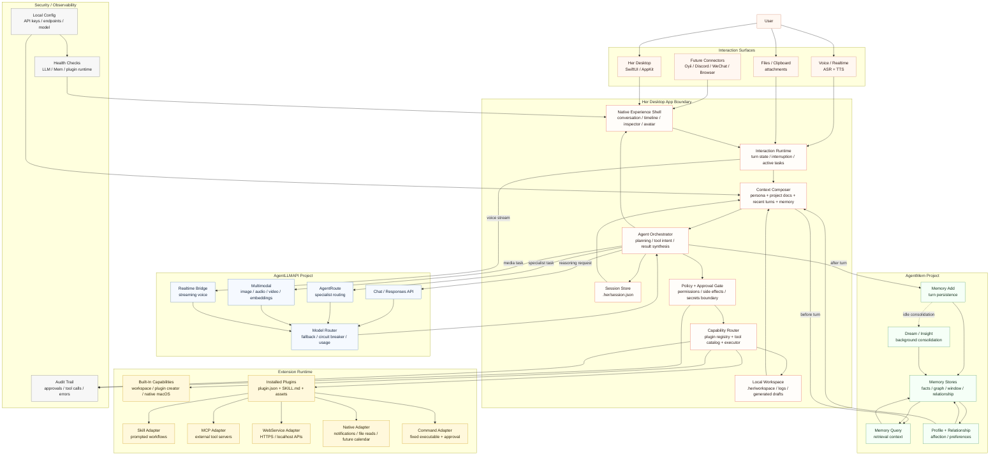
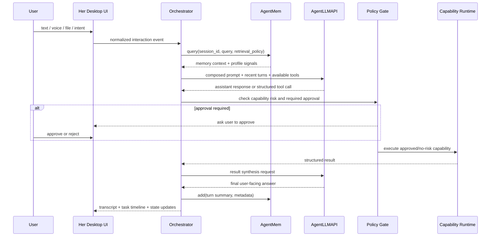

# Her Desktop Architecture V2

这版图的目标是把 Her Desktop 设计成一个可扩展的 Mac 原生 AI 数字合伙人：桌面端负责体验、状态、权限和编排；AgentLLMAPI 负责模型与多模态能力；AgentMem 负责长期记忆与关系状态；插件运行时负责把技能、MCP、Web 服务和本机能力安全接入。

## Key Boundaries

- Her Desktop 不直接拥有大模型供应链，也不直接拥有长期记忆数据库；它拥有用户体验、运行时状态、权限边界、上下文组装和工具编排。
- AgentLLMAPI 是模型能力网关，负责 Chat、AgentRoute、多模态、Realtime、fallback、circuit breaker 和用量治理。
- AgentMem 是人格连续性和关系连续性的系统，负责 query/add/profile/consolidation，而不是普通本地缓存。
- 插件运行时不是随意执行代码的后门；它应以 `plugin.json` 为能力契约，以审批队列和 adapter sandbox 为执行边界；内置扩展也从 bundled plugin manifests 加载。
- MCP、命令行、本机系统能力要比普通 skill/webservice 更高风险，默认需要明确权限模型和审计记录；当前 MCP 只允许通过本机 HTTP JSON-RPC bridge 执行，command 只允许运行固定 executable 和固定参数模板。

## Main Turn Flow

## Extension Creation Flow

```mermaid
flowchart LR
    Ask["User describes desired extension"] --> Draft["Vibe Plugin Creator\nplugin.draft"]
    Draft --> Review["Generated Draft Queue\nmanifest + skill + adapter config"]
    Review --> Approve["User reviews and installs"]
    Approve --> Registry["PluginRegistry\nsafe write into plugin dir"]
    Registry --> Catalog["Tool Catalog\nfunction schemas exposed to AgentLLMAPI"]
    Catalog --> Use["Assistant can call capability\nthrough approval + executor"]
    Use --> Audit["Audit trail + health state"]
```

## Design Critique Encoded In This Diagram

- 把 `Interactive` 拆成 `Runtime`、`Context Composer`、`Orchestrator`、`Policy Gate`，否则后面语音、工具、记忆和 UI 状态会全部缠在一起。
- `AgentLLMAPI` 和 `AgentMem` 不应该像普通工具一样挂在同一层；它们是平台服务，分别承载模型能力和人格连续性。
- 插件系统要从第一天就有 manifest、adapter、approval、audit 四个概念，不然扩展性会变成安全债。
- 多入口连接器可以后置，但内部事件模型要先抽象好：所有入口都变成 normalized interaction event。
- “陪伴”和“工作伙伴”不是两个模式，而是同一个 turn runtime 里不同上下文权重、记忆策略和工具风险策略的组合。
