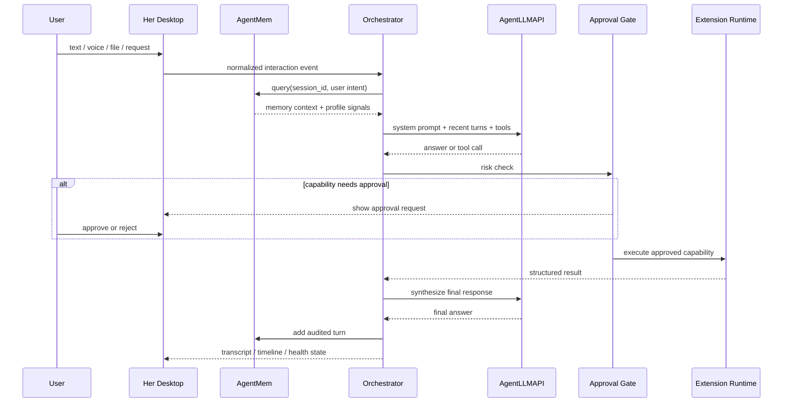

# Her Desktop Architecture V3

这张图把 Her Desktop 作为 Mac 原生 AI 数字合伙人的主体：它不把所有能力塞进一个巨型 Agent，而是用一个可审计、可扩展的本地运行时，把陪伴、工作协作、长期记忆、模型能力和外部工具编排在一起。

```mermaid
flowchart TB
    User["User\ntext / voice / files / intent"]

    subgraph Desktop["Her Desktop - Mac Native App"]
        UI["SwiftUI Experience Shell\nconversation / timeline / inspector / avatar"]
        Runtime["Interaction Runtime\nturn state / active tasks / interruption"]
        Session["Local Session Store\n.her/session.json"]
        Prompt["Context Composer\nSOUL + INFINITI + project docs + memory + recent turns"]
        Orchestrator["Agent Orchestrator\nplan / tool intent / synthesis"]
        Approval["Policy + Approval Gate\npermissions / side effects / secrets boundary"]
        Audit["Audit Trail + Health\nlogs / approvals / service checks"]
        Config["Local Config\nendpoints / keys / model / plugin dir"]
    end

    subgraph Extension["Extension Platform"]
        Registry["Plugin Registry\nbundled + .her/plugins"]
        Catalog["Tool Catalog\nOpenAI-compatible function schemas"]
        Executor["Capability Executor\nadapter sandbox + result envelope"]
        Composer["Vibe Plugin Composer\nAI draft / local draft / install review"]
        Builtins["Built-in Plugins\nworkspace / plugin creator / native macOS"]
        Skills["Skill Adapter\nSKILL.md workflows"]
        WebSvc["WebService Adapter\nHTTPS or localhost APIs"]
        MCP["MCP Adapter\nlocal HTTP JSON-RPC bridge"]
        Command["Command Adapter\nfixed executable + fixed args + approval"]
        Native["Native Adapter\nnotifications / approved text reads"]
    end

    subgraph LLM["AgentLLMAPI - Independent Project"]
        Chat["Chat / Tool Calling\nOpenAI-compatible"]
        Route["Agent Route\nspecialist routing"]
        Realtime["Realtime / Voice\nASR + TTS bridge"]
        Media["Multimodal\nimage / audio / video / embeddings"]
        ModelOps["Model Ops\nfallback / circuit breaker / usage"]
    end

    subgraph Memory["AgentMem - Independent Project"]
        Query["Memory Query\nbefore each turn"]
        Add["Memory Add\nafter audited turn"]
        Profile["Profile + Relationship\npreferences / affection / continuity"]
        Consolidate["Background Consolidation\ninsights / dream / summaries"]
        Stores["Memory Stores\nfacts / graph / windows / relationship"]
    end

    subgraph Future["Future Connectors"]
        Browser["Browser / Web"]
        ChatApps["Oyii / Discord / WeChat"]
        Calendar["Calendar / Mail / Files"]
        Phone["Phone / Tablet / Wearables"]
    end

    User --> UI
    Future --> Runtime
    UI --> Runtime
    Runtime --> Session
    Runtime --> Prompt
    Session --> Prompt
    Config --> Prompt
    Query --> Prompt
    Profile --> Prompt
    Prompt --> Orchestrator

    Orchestrator -->|"reasoning + available tools"| Chat
    Chat -->|"assistant message or tool call"| Orchestrator
    Orchestrator -->|"specialist work"| Route
    Orchestrator -->|"media work"| Media
    Runtime -->|"voice stream"| Realtime
    Chat --> ModelOps
    Route --> ModelOps
    Realtime --> ModelOps
    Media --> ModelOps

    Orchestrator --> Approval
    Approval --> Registry
    Registry --> Catalog
    Catalog --> Executor
    Composer --> Registry
    Registry --> Builtins
    Executor --> Skills
    Executor --> WebSvc
    Executor --> MCP
    Executor --> Command
    Executor --> Native
    Executor -->|"structured result"| Orchestrator

    Orchestrator -->|"final answer + metadata"| Add
    Query --> Stores
    Add --> Stores
    Profile --> Stores
    Consolidate --> Stores
    Stores --> Query
    Stores --> Profile
    Add -. "idle consolidation" .-> Consolidate

    Approval --> Audit
    Executor --> Audit
    Config --> Audit
    Audit --> UI
    Orchestrator --> UI

    classDef desktop fill:#fffdfa,stroke:#e66f61,color:#2a1c18
    classDef extension fill:#fff8dc,stroke:#d3a733,color:#2f2609
    classDef llm fill:#f5f9ff,stroke:#6d91bd,color:#14243a
    classDef mem fill:#f5fff7,stroke:#69a87b,color:#14301d
    classDef future fill:#f7f7f7,stroke:#8d8d8d,color:#222222
    classDef user fill:#fff7f1,stroke:#d8967d,color:#2d1b16

    class UI,Runtime,Session,Prompt,Orchestrator,Approval,Audit,Config desktop
    class Registry,Catalog,Executor,Composer,Builtins,Skills,WebSvc,MCP,Command,Native extension
    class Chat,Route,Realtime,Media,ModelOps llm
    class Query,Add,Profile,Consolidate,Stores mem
    class Browser,ChatApps,Calendar,Phone future
    class User user
```

## Core Principles

- Her Desktop 拥有体验、状态、权限、编排和本地扩展运行时；AgentLLMAPI 和 AgentMem 都是独立平台服务，不应该被设计成普通插件。
- “陪伴”和“工作伙伴”共享同一个 turn runtime，差异来自上下文权重、记忆策略、工具风险等级和 UI 表达，而不是两个割裂模式。
- 插件系统从第一天就要有 manifest、adapter、approval、audit 四件事；否则后续接入 MCP、命令行、本机自动化时会变成安全债。
- Vibe Plugin Composer 只负责生成和安装可审查的 plugin package；真实执行必须经过 capability executor，而不是让模型直接执行任意代码。
- 未来的 Oyii、Discord、微信、浏览器和设备入口都应先归一化成 interaction event，再进入同一个 runtime。

## Main Turn Loop

