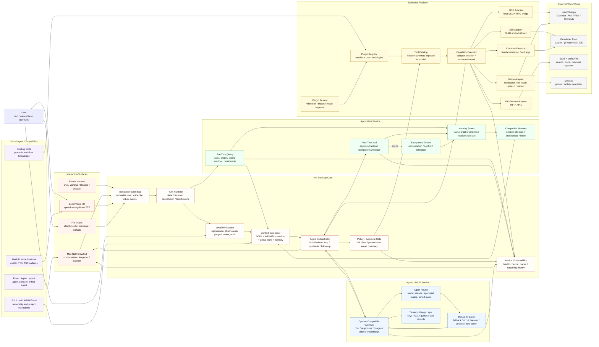
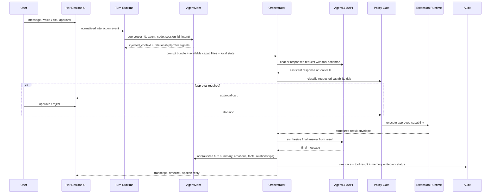
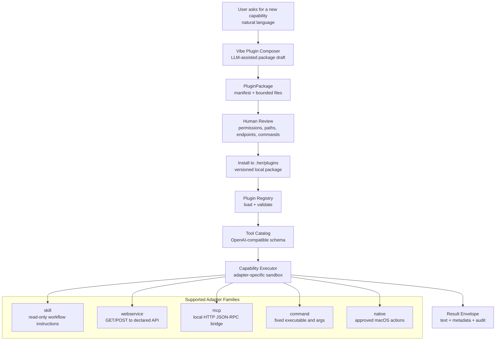

# Her Desktop Architecture V4

这版架构把 Her Desktop 设计成一个 Mac 原生的 AI 数字合伙人：体验在本机，思考走 AgentLLMAPI，长期关系和事实走 AgentMem，工作能力通过可审计的插件平台扩展。Infiniti Agent 不作为后端依赖强行塞进来，而是作为人格、项目级 agent layout、skills、LiveUI/voice 经验的兼容与迁移来源。

## Architecture Map

## Turn Loop

## Extension Contract

## Design Decisions

- **Her Desktop 是产品主体**：它负责用户体验、状态机、上下文装配、权限、审计和本机工作区。不要把 UI 做成 AgentLLMAPI 或 AgentMem 的“薄壳客户端”。
- **AgentLLMAPI 是模型基础设施**：它负责 OpenAI-compatible 协议、路由、fallback、探针、计费与配额。Her Desktop 只依赖稳定 API，不感知具体上游模型。
- **AgentMem 是关系与事实中枢**：对话前同步 query，对话后异步 add；陪伴感来自长期 profile、relationship、偏好、意图和 dream consolidation，而不是只靠最近聊天记录。
- **Infiniti-Agent 是经验资产层**：继承 SOUL/INFINITI、project agent layout、skills 和 LiveUI/voice 设计，但不要把旧 CLI/TUI runtime 直接嵌入 Mac App 主链路。
- **插件不是“模型直接执行代码”**：所有能力必须先进入 manifest、review、registry、tool schema、executor、audit 这条链路，再被模型调用。
- **外部入口统一成 event**：Oyii、Discord、微信、浏览器、设备等未来入口都先归一化为 interaction event，进入同一个 Turn Runtime，避免每个入口各自长出一套 agent。
