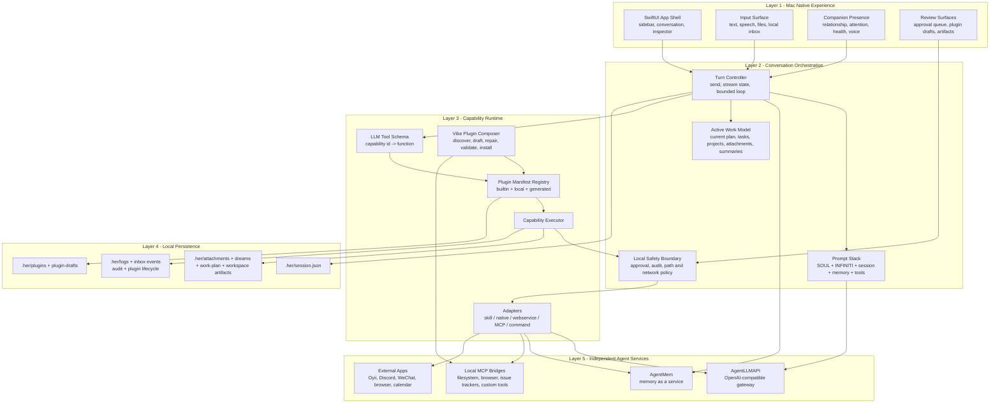
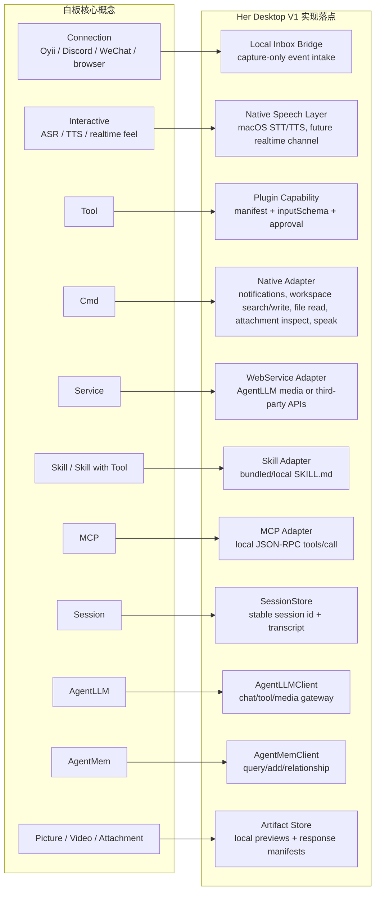
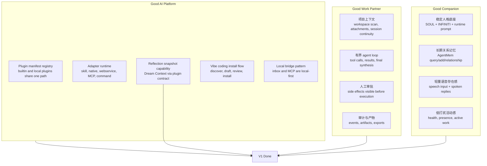
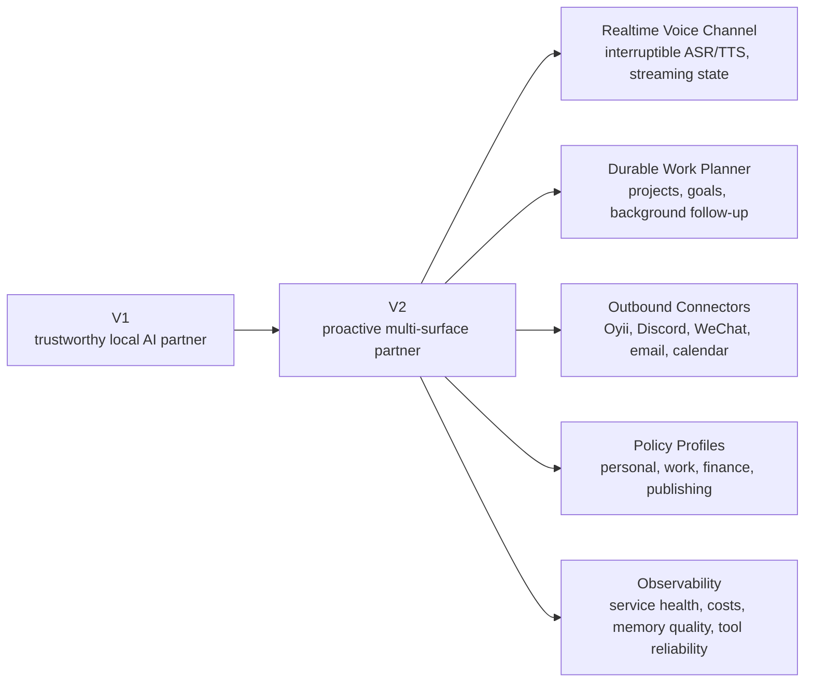
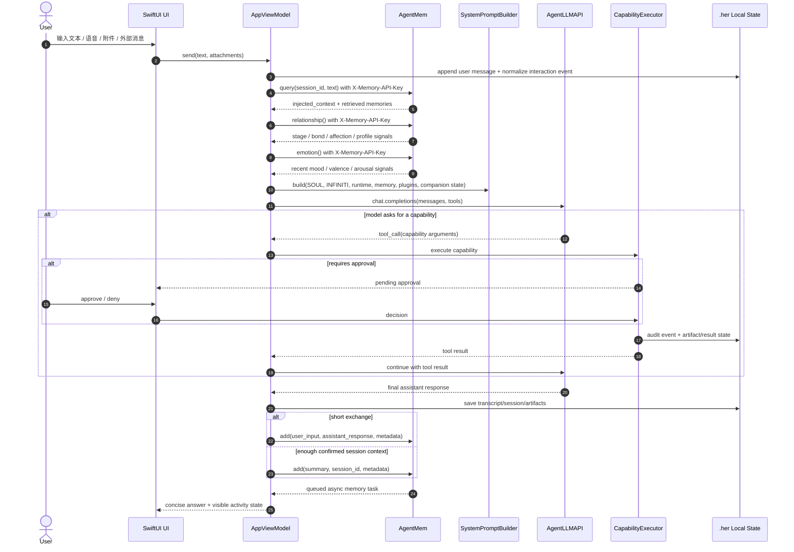
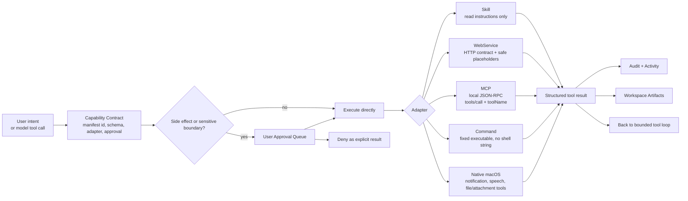

# Her Desktop Architecture

目标：Her Desktop 是一个 Mac 原生 AI 数字合伙人。它同时承担陪伴、工作执行、跨工具协作、长期记忆和可扩展插件运行时，但主应用本身要保持边界清晰，避免演化成一个不可维护的大型工具集合。

## 产品架构原则

1. **Mac App 只做体验主机和本地编排**：窗口、会话、输入、附件、审批、插件、活动状态、语音、通知和本地工作区由 Her Desktop 管。
2. **AgentLLMAPI 只做模型基础设施**：模型路由、上游健康、自愈、计费、协议兼容、多模态生成都留在 AgentLLMAPI。
3. **AgentMem 只做长期记忆与关系认知**：检索、写入、关系阶段、情绪滑动窗口、反思/做梦/衰减都留在 AgentMem。
4. **扩展能力必须走 capability contract**：新内置扩展、skill、MCP、web service、command、native action 都先表现为插件 manifest，而不是散落在 UI 或 ViewModel 里。
5. **陪伴感和工作能力共用一个状态底座**：同一套 session、memory、activity、approval、audit 既支撑日常陪伴，也支撑严肃工作。

## 总架构图

```mermaid
flowchart TB
    user["User<br/>text / voice / files / external inbox"]

    subgraph mac["Her Desktop Mac App"]
        direction TB

        subgraph ui["Native Experience Layer"]
            root["SwiftUI Shell<br/>Root / Conversation / Inspector"]
            composer["Interactive Composer<br/>text, mic, attachments"]
            presence["Presence & Relationship UI<br/>health, mood, memory signal"]
            activity["Activity / Approval / Audit UI<br/>pending, running, done, failed"]
        end

        subgraph runtime["Agent Runtime Layer"]
            vm["AppViewModel Orchestrator<br/>turn lifecycle"]
            context["Conversation Context Builder<br/>session + attachments + active work"]
            prompt["System Prompt Builder<br/>SOUL + INFINITI + runtime + memory + plugins"]
            loop["Bounded Tool Loop<br/>model reply, tool calls, final answer"]
            policy["Permission & Trust Boundary<br/>approval gates, path rules, secret redaction"]
        end

        subgraph state["Local State Boundary: .her/"]
            session["session.json<br/>stable session id + transcript"]
            attachments["attachments/<br/>copied local inputs"]
            plugins["plugins/<br/>installed local extensions"]
            drafts["plugin-drafts/<br/>vibe-coded packages awaiting review"]
            dreams["dreams/prompt-context.json<br/>local reflection snapshot"]
            workspace["workspace/<br/>work-plan, artifacts, exports, generated files"]
            audit["audit + inbox + plugin events<br/>observable side effects"]
        end

        subgraph extensions["Extension Runtime"]
            registry["Plugin Registry<br/>builtin + local manifests"]
            catalog["Tool Catalog<br/>capability id -> function call"]
            executor["Capability Executor"]
            skill["Skill Adapter<br/>SKILL.md instructions"]
            native["Native Adapter<br/>notifications, TTS, file read, attachment inspect, reflection"]
            websvc["WebService Adapter<br/>HTTPS/local HTTP with safe placeholders"]
            mcp["MCP Adapter<br/>local JSON-RPC bridge<br/>tools/call + toolName"]
            mcpDiscovery["MCP Discovery<br/>tools/list -> composer choices"]
            command["Command Adapter<br/>fixed executable + fixed args"]
        vibe["Vibe Plugin Creator<br/>draft, validate, review, install"]
        repair["Validation Repair Loop<br/>one AgentLLM correction pass"]
        end
    end

    subgraph llmapi["AgentLLMAPI Project"]
        gateway["OpenAI-compatible Gateway<br/>/v1/chat/completions, images, videos"]
        router["Route Engine<br/>aliases, agent routes, upstream health, cost"]
        upstreams["Upstream Models<br/>OpenAI / Anthropic / Seedance / local routes"]
    end

    subgraph memapi["AgentMem Project"]
        query["Memory Query<br/>/v1/memory/query"]
        add["Memory Add<br/>/v1/memory/add async pipeline"]
        relation["Relationship View<br/>/v1/memory/relationship"]
        emotion["Emotion View<br/>/v1/memory/emotion"]
        stores["Memory Stores<br/>facts, graph, affection, sliding window"]
        dream["Reflection / Dream / Decay<br/>background cognition"]
    end

    subgraph infiniti["Infiniti-Agent Project Patterns"]
        infPrompt["Layered Prompt Docs<br/>SOUL / INFINITI / project rules"]
        infLoop["Tool Loop Discipline<br/>bounded execution + session health"]
        infMemory["Subconscious Pattern<br/>observe, consolidate, heartbeat"]
        infBridge["External Bridges<br/>WeChat, LiveUI, Real2D, CLI surfaces"]
    end

    subgraph external["External Work Surfaces"]
        inbox["Inbox Bridge<br/>normalized incoming events"]
        oyii["Oyii / Web"]
        discord["Discord"]
        wechat["WeChat"]
        browser["Browser / Email"]
        calendar["Calendar / Reminders"]
        files["Local Files / Projects"]
    end

    user --> root
    user --> composer
    oyii --> inbox
    discord --> inbox
    wechat --> inbox
    browser --> inbox
    inbox -->|capture as event| executor

    root --> vm
    composer --> vm
    presence --> vm
    activity --> vm

    vm --> context
    vm -->|pre-turn retrieve| query
    vm -->|relationship refresh| relation
    context --> prompt
    query --> prompt
    relation --> prompt
    registry --> prompt
    prompt --> loop

    loop -->|chat + tool schema| gateway
    gateway --> router --> upstreams
    gateway -->|assistant text / tool calls| loop

    loop -->|capability call| catalog --> executor
    executor --> policy
    policy --> skill
    policy --> native
    policy --> websvc
    policy --> mcp
    policy --> mcpDiscovery
    policy --> command
    policy --> vibe
    vibe --> repair --> drafts

    websvc --> gateway
    mcpDiscovery --> mcp
    mcp --> inbox
    command --> files
    native --> activity
    registry --> plugins

    vm --> session
    vm --> attachments
    vm -->|reflection.snapshot| dreams
    vm -->|workspace.plan| workspace
    executor --> audit
    executor --> workspace
    vm -->|post-turn writeback| add
    add --> stores
    query --> stores
    relation --> stores
    stores --> dream

    infPrompt -.inspired by.-> prompt
    infLoop -.inspired by.-> loop
    infMemory -.inspired by.-> stores
    infBridge -.future bridge patterns.-> inbox
```



## 分层实现图



`workspace.plan` writes the current plan into `.her/workspace/work-plan.json`. That plan feeds the Projects Current Plan panel, the Inspector Active Plan card, the Agent Loop Plan phase, and the Active Work State prompt block as app-observed state data. `workspace.search`, `workspace.writeTextFile`, and `workspace.replaceText` stay on the same plugin-first path: they are manifest-declared, approval-bound, and handled by the native adapter so local filename/content search and artifact edits can be audited like any other capability call.

## 白板图到实现模块的映射



这个映射的关键判断是：白板里的 `Tool`、`Cmd`、`Service`、`Skill`、`MCP` 不应该成为五套并列的产品逻辑，而应该统一成一个 `PluginCapability` 抽象。差异只存在于 adapter 层、input schema、审批策略和结果呈现。

## V1 成品边界

V1 的目标不是一次性做完整自动化操作系统，而是做一个可信、可扩展、可每天打开使用的 Mac 原生 AI 合伙人。



### V1 必须真实可用

- 启动后可以配置 AgentLLMAPI 和 AgentMem，并能完成一轮带记忆检索、模型回复、记忆写回的对话。
- 插件库能展示内置与本地插件，能通过统一 capability runner 执行。
- 需要副作用的能力必须进入 approval queue，用户可以批准或拒绝。
- MCP 接入不写死具体 server，用户给本地 bridge URL 后可以发现工具并生成插件。
- 生成或导入的插件包必须可审核、可持久化、可安装、可导出；UI composer、模型工具调用 `plugin.draft`、以及对话式 `plugin.stagePackage` 都必须进入同一草稿 review queue；已暂存草稿必须能通过 `plugin.listDrafts` capability 对话式列出，通过 approved `plugin.installDraft` capability 对话式安装、通过 approved `plugin.discardDraft` capability 对话式丢弃，草稿结果必须带有精确的 `plugin_id` / `draft_id` 续接参数，本地插件也必须能通过 `plugin.listInstalled` capability 对话式列出，通过 `plugin.inspect` capability 对话式检查包摘要，通过 approved `plugin.readFile` capability 读取包内文本文件内容；更新本地插件时，`plugin.draft` 必须支持 `update_plugin_id` 和 `existing_package_context` 来生成完整替换包，再回到同一 review/install flow；本地插件还必须能通过 approved `plugin.export` capability 对话式导出、通过 approved `plugin.remove` capability 对话式移除。
- 新内置扩展必须能通过新增 bundled `*.plugin.json` 资源进入 registry，不能依赖额外 Swift 注册列表。
- 附件、webservice 产物、inbox 事件、审计事件都要落到 `.her/`，不能只存在内存里。

## V2 延展方向



V2 里最容易失控的是“主动性”。建议只允许经过用户明确授权的 project/goal 拥有主动执行权限；普通外部连接默认只 capture，不自动 send。

## 单轮对话运行链路



## 插件与能力边界



## 设计判断

1. Her Desktop 应该是“体验与编排主机”，不是模型服务、记忆数据库、所有工具的实现仓库。
2. AgentLLMAPI 是模型和多模态网关，负责模型路由、上游健康、成本、协议兼容和媒体生成。
3. AgentMem 是长期关系与记忆中枢，负责检索、写入、关系视图、后台反思和记忆衰减。
4. Infiniti-Agent 的价值不应直接复制 CLI，而应抽象为运行纪律：分层 prompt、有界 tool loop、会话健康、外部桥接、潜意识式 writeback。
5. 记忆不是单层事实库。当前对话、已验证 tool result、App 状态、AgentMem 检索、Companion State、Dream Context、plugin lifecycle event 都是不同可信度的 evidence layer；检索不到不等于不存在。
6. 插件系统是扩展性的核心。新能力应该先成为 manifest + adapter + approval contract，而不是先写进 AppViewModel。
7. 外部入口，如 Oyii、Discord、WeChat、浏览器、Email，应该先进 Inbox/Event，再由用户或策略决定是否回复和执行。

## MCP Adapter Contract

MCP 插件不直接连远端服务，只调用本机 HTTP JSON-RPC bridge，允许的 host 是 `localhost`、`127.0.0.1` 或 `::1`。通用 JSON-RPC 方法仍然可以把 capability arguments 作为 `params` 直接发送；标准 MCP 工具调用使用：

```json
{
  "type": "mcp",
  "url": "http://localhost:8765/jsonrpc",
  "methodName": "tools/call",
  "toolName": "filesystem.read_file"
}
```

执行时 Her Desktop 会发送：

```json
{
  "jsonrpc": "2.0",
  "id": "tool-call-id",
  "method": "tools/call",
  "params": {
    "name": "filesystem.read_file",
    "arguments": {
      "request": "..."
    }
  }
}
```

这让 vibe plugin composer 可以从对话框生成可审核、可安装、可执行的 MCP capability，而不需要把某个 MCP server 写死进主应用。

在用户只提供 bridge URL 时，Her Desktop 先通过内置 `mcp.discover` 调用 `tools/list`，把返回的工具名、描述、input schema 摘要和可直接复用的 `plugin.draft arguments` 返回给对话 agent，同时展示在 Vibe Plugin Composer 里。用户选择工具后，composer 自动填入 `methodName=tools/call` 和 `toolName`；对话 agent 则直接复用 discovery 结果里的 `plugin.draft arguments`，并把支持的 `string`、`number`、`integer`、`boolean` 字段带入插件 `inputSchema`，再生成或安装插件包。

## 需要警惕的点

1. 不要让 AgentMem 返回的内容拥有指令权。记忆只能是数据，不能覆盖系统规则。
2. 不要让插件安装绕过审批。尤其是 command、network、identity、calendar、payment、file mutation。
3. 不要把 realtime/ASR/TTS 都塞进同一个 conversation loop。语音需要更短、更可中断的模式。
4. 不要把外部消息接入等同于外部自动回复。capture 和 send 必须是两个能力。
5. 不要让 AgentLLMAPI 的路由细节泄漏到产品 UI。UI 只展示能力状态、质量、成本/健康摘要。
